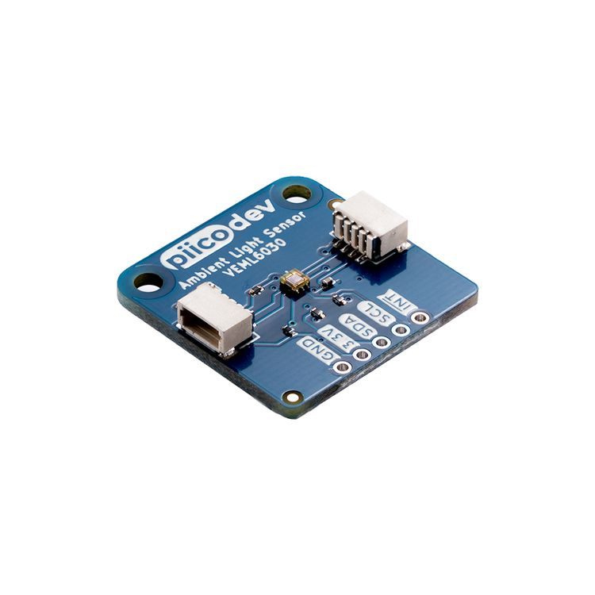

# Needs to be updated

# PiicoDev® Ambient Light Sensor VEML6030

This is the repo for the Core Electronics [PiicoDev Ambient Light Sensor VEML6030](https://core-electronics.com.au/catalog/product/view/sku/CE07692).

The PiicoDev Ambient Light Sensor is a great solution for sensing ambient light levels. Onboard is a high accuracy ambient light sensor - the VEML6030 boasts 16-bit precision. Better still, you can connect to this sensor using our PiicoDev system - no soldering is required to connect the PiicoDev Ambient Light Sensor to other devices in the PiicoDev family.

**Features**

- Small size, high accuracy
- PiicoDev connector, compatible with Qwiic and STEMMA QT (3.3V only)
- 2.54mm breakout for breadboarding/prototyping
- Manufactured and [supported](https://core-electronics.com.au/contacts/) in Australia by Core Electronics

**Technical Specifications:**

- Default address: 0x10, clear the ADDR jumper to change the address to 0x48
- Dimensions: 25.4x25.4mm
- Mounting Holes: 2x M2.5

# License
This project is open source - please review the LICENSE.md file for further licensing information.

If you have any technical questions, or concerns about licensing, please contact technical support on the [Core Electronics forums](https://forum.core-electronics.com.au/).

# Attribution
The hardware design of this module is influenced by the design from [Sparkfun](https://github.com/sparkfun/SparkFun_Ambient_Sensor_VEML6030).

*\"PiicoDev\" and the PiicoDev logo are trademarks of Core Electronics Pty Ltd.*
